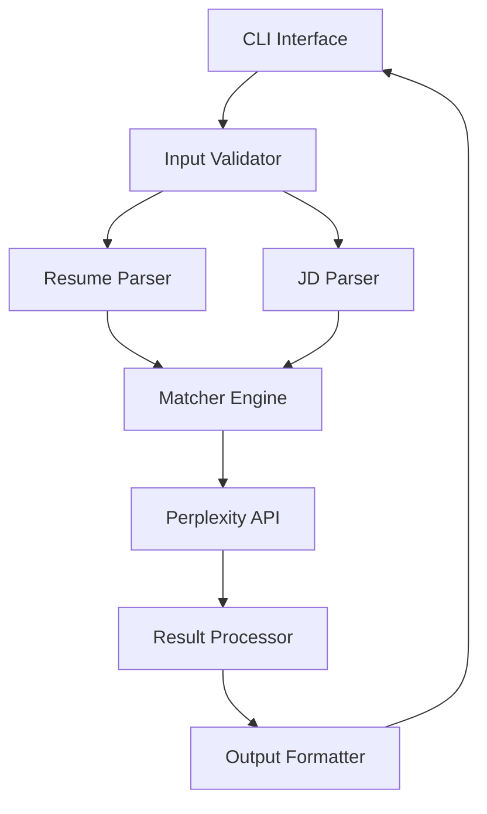

# Design Document

## Overview

The Resume + JD Matcher Agent is a Python-based CLI application that leverages AI to analyze compatibility between resumes and job descriptions. The system uses a modular architecture with separate components for document parsing, AI-powered matching analysis, and result presentation. The core intelligence comes from the Perplexity API, which provides contextual understanding of skills, experience, and job requirements.

The application follows a pipeline architecture: Input → Parse → Analyze → Score → Present, with each stage handling specific responsibilities and error conditions gracefully.

## Architecture

### High-Level Architecture



### Component Interaction Flow

1. **Input Phase**: CLI collects resume file path and job description text
2. **Validation Phase**: Validates file existence, format, and content
3. **Parsing Phase**: Extracts text from PDF resume and processes JD text
4. **Analysis Phase**: Sends structured data to Perplexity API for intelligent matching
5. **Processing Phase**: Interprets API response and calculates scores
6. **Output Phase**: Formats and presents results to user

## Components and Interfaces

### 1. Main Application (`main.py`)

**Purpose**: Entry point and CLI orchestration

**Key Functions**:
- `main()`: Primary application loop
- `get_user_input()`: Collect resume file and JD text
- `display_results()`: Format and show analysis results
- `handle_errors()`: Centralized error handling

**Interface**:
```python
def main() -> None
def get_user_input() -> Tuple[str, str]  # Returns (resume_path, jd_text)
def display_results(results: MatchResult) -> None
```

### 2. Resume Parser (`resume_parser.py`)

**Purpose**: Extract and clean text from PDF resumes

**Key Functions**:
- `extract_text_from_pdf()`: Use PyMuPDF to extract text
- `clean_resume_text()`: Remove formatting artifacts and normalize text
- `validate_resume_content()`: Ensure extracted text is meaningful

**Dependencies**: PyMuPDF (fitz)

**Interface**:
```python
def extract_text_from_pdf(file_path: str) -> str
def clean_resume_text(raw_text: str) -> str
def validate_resume_content(text: str) -> bool
```

**Error Handling**:
- File not found or corrupted PDF
- Empty or unreadable content
- Unsupported PDF formats

### 3. Job Description Parser (`jd_parser.py`)

**Purpose**: Process and structure job description text

**Key Functions**:
- `parse_jd_text()`: Clean and structure JD content
- `extract_requirements()`: Identify key requirements and skills
- `categorize_skills()`: Separate technical vs soft skills

**Interface**:
```python
def parse_jd_text(jd_text: str) -> Dict[str, Any]
def extract_requirements(jd_text: str) -> List[str]
def categorize_skills(skills: List[str]) -> Dict[str, List[str]]
```

### 4. Matcher Engine (`matcher.py`)

**Purpose**: Core matching logic and API integration

**Key Functions**:
- `analyze_match()`: Orchestrate the matching process
- `call_perplexity_api()`: Interface with Perplexity API
- `calculate_score()`: Generate 0-100% compatibility score
- `identify_gaps()`: Find missing skills and experience
- `generate_suggestions()`: Create improvement recommendations

**Interface**:
```python
def analyze_match(resume_text: str, jd_data: Dict) -> MatchResult
def call_perplexity_api(prompt: str) -> str
def calculate_score(api_response: str) -> int
def identify_gaps(resume_text: str, jd_data: Dict, api_response: str) -> List[str]
def generate_suggestions(gaps: List[str], api_response: str) -> List[str]
```

### 5. Utilities (`utils.py`)

**Purpose**: Shared utilities and configuration

**Key Functions**:
- `load_config()`: Load API keys and settings
- `validate_api_key()`: Check Perplexity API key validity
- `format_prompt()`: Create optimized prompts for Perplexity
- `handle_rate_limits()`: Manage API rate limiting

**Interface**:
```python
def load_config() -> Dict[str, str]
def validate_api_key(api_key: str) -> bool
def format_prompt(resume_text: str, jd_text: str) -> str
def handle_rate_limits(response: requests.Response) -> None
```

## Data Models

### MatchResult Class

```python
@dataclass
class MatchResult:
    score: int  # 0-100 compatibility percentage
    match_category: str  # "Poor", "Moderate", "Strong"
    matching_skills: List[str]  # Skills found in both documents
    missing_skills: List[str]  # Skills in JD but not resume
    skill_gaps: Dict[str, str]  # Gap category -> skills mapping
    suggestions: List[str]  # Improvement recommendations
    processing_time: float  # Analysis duration in seconds
```

### JobDescription Class

```python
@dataclass
class JobDescription:
    raw_text: str
    title: str
    requirements: List[str]
    technical_skills: List[str]
    soft_skills: List[str]
    experience_level: str
    key_responsibilities: List[str]
```

### ResumeData Class

```python
@dataclass
class ResumeData:
    raw_text: str
    cleaned_text: str
    skills: List[str]
    experience: List[str]
    education: List[str]
    word_count: int
```

## Error Handling

### Error Categories and Responses

1. **File Errors**:
   - Missing resume file → Clear error message with file path check
   - Corrupted PDF → Suggest alternative file or format
   - Empty content → Request different resume

2. **API Errors**:
   - Invalid API key → Display setup instructions
   - Rate limit exceeded → Show wait time and retry option
   - Network issues → Suggest checking connection and retry

3. **Input Errors**:
   - Empty job description → Request valid JD text
   - Invalid format → Show expected input format
   - Processing timeout → Offer to retry with shorter content

### Error Recovery Strategies

- Graceful degradation: Continue with available data when possible
- User guidance: Provide specific instructions for resolving issues
- Retry mechanisms: Allow users to retry failed operations
- Fallback options: Suggest alternative approaches when primary method fails

## Testing Strategy

### Unit Testing

**Resume Parser Tests**:
- Test PDF text extraction with various resume formats
- Validate text cleaning and normalization
- Test error handling for corrupted files

**JD Parser Tests**:
- Test skill extraction from different JD formats
- Validate requirement categorization
- Test handling of various text lengths

**Matcher Engine Tests**:
- Mock Perplexity API responses for consistent testing
- Test score calculation logic
- Validate suggestion generation

### Integration Testing

**End-to-End Workflow**:
- Test complete pipeline with sample resume/JD pairs
- Validate API integration with real Perplexity calls
- Test error propagation through the system

**API Integration Tests**:
- Test API key validation
- Test rate limit handling
- Test network error recovery

### Performance Testing

**Response Time**:
- Target: Complete analysis within 30 seconds
- Test with various document sizes
- Monitor API call efficiency

**Resource Usage**:
- Memory usage during PDF processing
- API call optimization
- Concurrent request handling

### User Acceptance Testing

**Accuracy Validation**:
- Test with known resume/JD pairs
- Validate score accuracy against manual assessment
- Test suggestion relevance and actionability

**Usability Testing**:
- CLI interface ease of use
- Error message clarity
- Output format readability

## Implementation Considerations

### Perplexity API Optimization

**Prompt Engineering**:
- Structured prompts for consistent responses
- Context optimization to stay within token limits
- Response format specification for easier parsing

**Cost Management**:
- Efficient prompt design to minimize token usage
- Caching strategies for repeated analyses
- Usage tracking and alerts

### Security and Privacy

**Data Handling**:
- No persistent storage of resume content
- Secure API key management
- Clear data processing disclosure

### Scalability Considerations

**Future Enhancements**:
- Batch processing capability
- Web interface integration points
- Database storage for analytics
- Multi-format resume support (Word, text files)

### Configuration Management

**Environment Setup**:
- `.env` file for API keys
- Configuration validation on startup
- Clear setup documentation

**Deployment Options**:
- Local execution
- Containerization for distribution
- Cloud deployment preparation